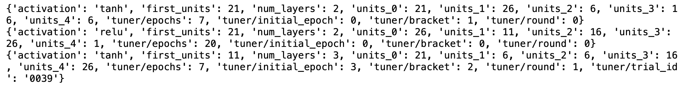
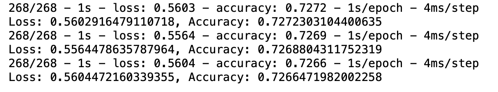
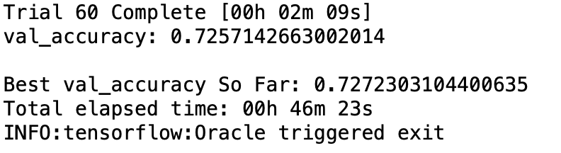
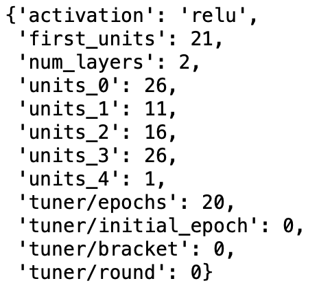
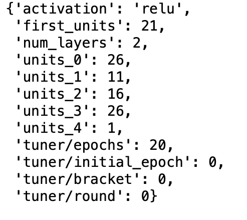

# Neural_Network_Charity_Analysis

## Overview

In this work, Neural Network Modeling (Deep Learning) was used to help a foundation (Alphabet Soup) to perform loan risk assessment for predicting where to make investments on their applicants using data (in a a CSV) containing more than 34,000 organizations that have received funding from Alphabet Soup over the years. Within this dataset are a number of columns that capture metadata about each organization. The data were preprocessed, and split into training and test dataset. The initial neural network models were assesed, and then were optimized with the aim to achieve > 75% accuracy. 

**Tools:**
- Python and Pandas
- Jupyter Notebook
- Scikit-Learn
- Tensorflow
- Keras tuner
- Git

## Results

For the three try outs, the model weights were successfully save on each 5th epoch (available in GitHub repository (checkpoint_01, checkpoint_02, and checkpoint_03, respectively. 

- For the initial Neural Network model, 2 hidden layers, and the output model was used as follows.
  - 1st hidden layer: Dense(units=24, input_dim=number_input_features, activation="relu"
  - 2nd hidden layer:Dense(units=12, activation="relu"
  - Output layer: Dense(units=1, activation="sigmoid"
  - loss="binary_crossentropy", optimizer="adam", metrics= "accuracy", epochs = 50
  - The model accuracy = 0.72, loss = 0.56 

Then the model was re-run 3 times as follows.
- 1st try (manual)
  - 1st hidden layer: Dense(units=30, input_dim=number_input_features, activation="relu"
  - 2nd hidden layer:Dense(units=12, activation="relu"
  - 3rd hidden layer:Dense(units=8, activation="relu"
  - Output layer: Dense(units=1, activation="sigmoid"
  - loss="binary_crossentropy", optimizer="adam", metrics= "accuracy", epochs = 100
  - The model accuracy = 0.72, loss = 0.56 

- 2nd try (manual)
  - 1st hidden layer: Dense(units=50, input_dim=number_input_features, activation="tanh"
  - 2nd hidden layer:Dense(units=20, activation="relu"
  - 3rd hidden layer:Dense(units=10, activation="relu"
  - Output layer: Dense(units=1, activation="sigmoid"
  - loss="binary_crossentropy", optimizer="adam", metrics= "accuracy", epochs = 100
  - The model accuracy = 0.72, loss = 0.56 

- 3rd try (manual)
  - 1st hidden layer: Dense(units=24, input_dim=number_input_features, activation="relu"
  - 2nd hidden layer:Dense(units=12, activation="tanh"
  - Output layer: Dense(units=1, activation="sigmoid"
  - loss="binary_crossentropy", optimizer="adam", metrics= "accuracy", epochs = 100
  - The model accuracy = 0.72, loss = 0.56 

- Hyperparameter Optimization using Keras Tuner

  - Top 3 models against the test dataset
 
   
  
  **Top three models hyperparameters**
  
   
  
  **Top three models against the test dataset**
  
  
  
  **Model accuracy after 60**
  
  
  - First model
    - 268/268 - 1s - loss: 0.5603 - accuracy: 0.7272 - 1s/epoch - 4ms/step
    - Loss: 0.5602916479110718, Accuracy: 0.7272303104400635
    
  - Second model 
    - 268/268 - 1s - loss: 0.5564 - accuracy: 0.7269 - 1s/epoch - 4ms/step
    - Loss: 0.5564478635787964, Accuracy: 0.7268804311752319
    
    
     
  
     **Second best model hyperparameters**
   
  - Third model
    - 268/268 - 1s - loss: 0.5604 - accuracy: 0.7266 - 1s/epoch - 4ms/step
    - Loss: 0.5604472160339355, Accuracy: 0.7266471982002258
    
    
  
    **Third best model hyperparameters**

For full results, see the notebook. 

# Summary

In summary, a deep learning neural network modeling was performed to model predict which charities should be funded. First, some manual runs were performed, and then the keran tuner was to optimize hyperparameters. The top 3 models in this analysis only achieved 73% accuracy (with loss = ~ 56%. My models failed to achieve the target of > 75% accuracy.

